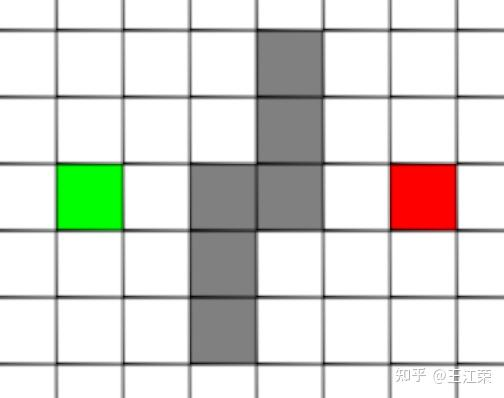
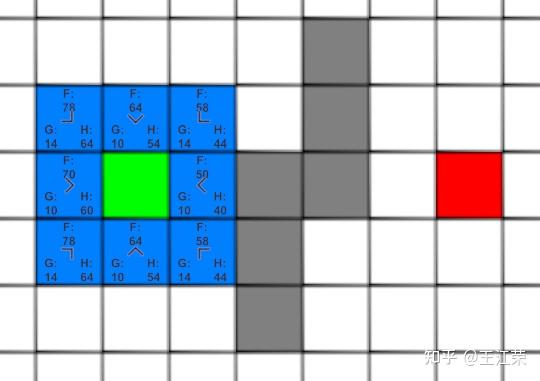
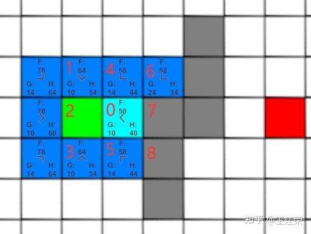
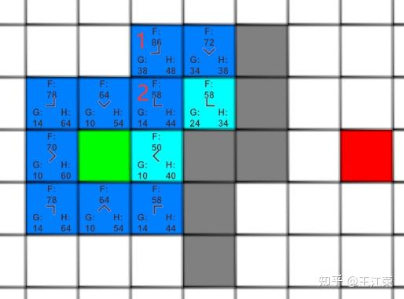
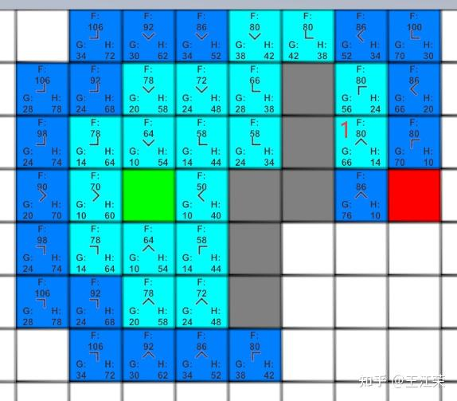

## A*寻路

A*是游戏中常见的寻路方式，很有效的平衡了速度和准确率
**公式：F(n) = G(n) + H(n)**
**G(n) 指的是从起始格子到格子n的实际代价，而 H(n) 指的是从格子n到终点格子的估计代价。**

### H(n)的三种预估方法
首先我们认为**只有沿着对角线才可以斜着移动**
**1. 欧式距离**

   **弊端：**

   - 不断有平方和开根号运算
   - 且H（n）永远小于或者等于格子n到终点的实际最短距离

**2. 曼哈顿距离**

   **优点：** 运算很简单，全是整数

   **弊端：** H（n）永远大于或者等于格子n到终点的实际最短距离

**3. 对角线+直线距离**：先用差距小的那个值，走那个值的正方形的对角线，然后再平移

   **优点:** 在不考虑障碍物的情况下等于n到终点的最短实际距离

   **弊端：** 有平方和开更号 

   **解决方法:** 通过假设格子间距离为10，对角线为14

**总结来说：**
- 如果 h(n) <= n到终点的实际距离，A*算法可以找到最短路径，但是搜索的点数多，搜索范围大，效率低。

- 如果 h(n) > n到终点的实际距离，搜索的点数少，搜索范围小，效率高，但是得到的路径并不一定是最短的。
- h(n) 越接近 n到终点的实际距离，那么A*算法越完美
### A*具体的寻路过程

**第一步** 我们对周围的8个格子进行预估到目标的距离结果如下

**第二步** 我们找到周围F值最小的点，

**第三步**我们从剩下的8个深蓝色的格子中再找出f(n)最小的格子，由于有3个等于58的格子，我们随便取一个计算它周边的格子，如下图：
**我认为不应该随便取，而是取G值最小的这个，因为估算的是不确定的，而g是确定的，我们应该优先让确定的更小**

这里可以发现，格子1的g值并不是最小的，但是不要紧，当我们后面计算到格子2时，会更新格子1的g值（前面说了会用较小的g值），并且箭头指向格子2。
**最后一步** 找到终点

然后将路径一直找父亲再逆序及为路径

### 辅助实现
**每个格子节点**
```cs
public enum TileNodeState : int
{
    Available = 0,
    OccupyWalkable = 1,
    Occupy = 2,
}
public class Node : IComparable<Node>
{
    public Node parent;
    public Vector2Int coordinate;
 
    public TileNodeState state;
    private int g;
    private int h;
    private int f;
    //实际距离
    public int G
    {
        get { return g; }
        set { g = value; f = g + h; }
    }
    //估算距离
    public int H
    { 
        get { return h; } 
        set { h = value; f = g + h; } 
    }
    //计算大致距离
    public int F => f;
    public Node(Vector2Int pos, Node parent, int g, int h,TileNodeState state = TileNodeState.Available)
    {
        coordinate = pos;
        this.parent = parent;
        this.g = g;
        this.h = h;
        f = this.g +this.h;
        this.state = state; // 确保状态被赋值
    }
    // 一个更简单的构造函数，在初次创建地图时很有用
    public Node(Vector2Int pos, TileNodeState state = TileNodeState.Available)
    {
        this.coordinate = pos;
        this.state = state;
        this.parent = null;
        this.g = 0;
        this.h = 0;
        this.f = 0;
    }
    /// <summary>
    /// 实现比较方法，让优先队列知道如何排序
    /// </summary>
    /// <param name="other">要比较的另一个节点</param>
    /// <returns>
    ///   < 0: 当前实例排在 other 之前 (优先级更高)
    ///   = 0: 顺序相同
    ///   > 0: 当前实例排在 other 之后 (优先级更低)
    /// </returns>
    public int CompareTo(Node other)
    {
        // 首先比较 F 值。F 值小的优先级高。
        int compare = F.CompareTo(other.F);

        // 如果 F 值相同，则比较 H 值（作为决胜局）。H 值小的更接近终点，优先处理。
        if (compare == 0)
        {
            compare = H.CompareTo(other.H);
        }
        return compare;
    }

}
```
**索引器地图讲节点封装**
```cs
/// <summary>
/// 索引器地图
/// </summary>
[System.Serializable]
public class NodeMap
{
    public Node[,] nodeMap;
    public int row;
    public int column;

    public Node this[int x, int y]
    {
        get
        {
            if (x < 0 || y < 0 || x >= nodeMap.GetLength(0) || y >= nodeMap.GetLength(1))
                return null;

            return nodeMap[x, y];
        }
        set
        {
            if (x < 0 || y < 0 || x >= nodeMap.GetLength(0) || y >= nodeMap.GetLength(1))
                return;

            nodeMap[x, y] = value;
        }
    }

    public Node this[Vector2Int coordinate]
    {
        get
        {
            if (coordinate.x < 0 || coordinate.y < 0
                || coordinate.x >= nodeMap.GetLength(0) || coordinate.y >= nodeMap.GetLength(1))
                return null;

            return nodeMap[coordinate.x, coordinate.y];
        }
        set
        {

            if (coordinate.x < 0 || coordinate.y < 0
                || coordinate.x >= nodeMap.GetLength(0) || coordinate.y >= nodeMap.GetLength(1))
                return;

            nodeMap[coordinate.x, coordinate.y] = value;
        }
    }

    public NodeMap(Node[,] nodeMap)
    {
        this.nodeMap = nodeMap;
        row = nodeMap.GetLength(0);
        column = nodeMap.GetLength(1);
    }
    // 按尺寸创建地图的构造函数
    public NodeMap(int width, int height)
    {
        row = width;
        column = height;
        nodeMap = new Node[width, height];
        for (int i = 0; i < width; i++)
        {
            for (int j = 0; j < height; j++)
            {
                nodeMap[i, j] = new Node(new Vector2Int(i, j));
            }
        }
    }
    /// <summary>
    /// 重置地图中所有节点的寻路状态 (parent, G, H, F)。
    /// </summary>
    public void ResetNodeStates()
    {
        for (int x = 0; x < row; x++)
        {
            for (int y = 0; y < column; y++)
            {
                nodeMap[x, y].parent = null;
                nodeMap[x, y].G = 0;
                nodeMap[x, y].H = 0;
                // F 值会自动被 G 和 H 更新，无需手动重置
            }
        }
    }
}
```
### 详细解释A*算法实际实现
本文采用优先队列进行优化未处理列表
因为要不断查询处理完成列表，将其设为set
```cs
PriorityQueue<Node> openQueue;//准备处理
HashSet<Node> closedSet;//处理完成
Vector2Int start, target;
NodeMap map;
```
寻路函数，没什么特别的
```cs
public List<Node> FindPath(NodeMap mapData, Vector2Int startPos, Vector2Int targetPos)
{
    // 1. 初始化
    this.map = mapData;
    this.start = startPos;
    this.target = targetPos;

    // 初始化优先队列
    openQueue = new PriorityQueue<Node>((a, b) => a.CompareTo(b));
    closedSet = new HashSet<Node>();

    Node startNode = map[start];
    Node targetNode = map[target];

    if (startNode == null || targetNode == null || startNode.state == TileNodeState.Occupy)
    {
        Debug.LogWarning("AStar: 起点或终点无效，或起点是障碍物。");
        return null;
    }

  
    openQueue.Enqueue(startNode);

   
    // 开始处理待处理列表
    while (openQueue.Count > 0)
    {
        // Dequeue() 会自动返回并移除 F 值最小的节
        Node currentNode = openQueue.Dequeue();
        if (closedSet.Contains(currentNode))
        {
            continue;
        }

        closedSet.Add(currentNode);


        // 3. 找到目标
        if (currentNode == targetNode)
        {
            return RetracePath(startNode, targetNode);
        }

        // 4. 处理邻居节点
        ProcessNeighbors(currentNode);
    }

    Debug.LogWarning("AStar: 未找到路径。");
    return null;
}
```
**关键函数：将周围节点加入待处理**
```cs
private void ProcessNeighbors(Node currentNode)
{
    for (int x = -1; x <= 1; x++)
    {
        for (int y = -1; y <= 1; y++)
        {
            if (x == 0 && y == 0)
                continue;

            Vector2Int neighborPos = new Vector2Int(currentNode.coordinate.x + x, currentNode.coordinate.y + y);
            Node neighborNode = map[neighborPos];

            if (!IsNeighborValid(neighborNode))
                continue;

            // --- 新增的“防穿角”逻辑 ---
            // 判断是否是斜向移动
            if (Mathf.Abs(x) == 1 && Mathf.Abs(y) == 1)
            {
                // 如果是斜向移动，就检查它相邻的两个垂直/水平方向的格子
                // 例如，如果要移动到 (x+1, y+1)，就需要检查 (x+1, y) 和 (x, y+1)
                Node adjacentNode1 = map[currentNode.coordinate.x + x, currentNode.coordinate.y];
                Node adjacentNode2 = map[currentNode.coordinate.x, currentNode.coordinate.y + y];

                // 如果这两个相邻的格子都是障碍物，那么这条对角线路径就是不通的
                if (adjacentNode1 != null && adjacentNode1.state == TileNodeState.Occupy &&
                    adjacentNode2 != null && adjacentNode2.state == TileNodeState.Occupy)
                {
                    continue; // 跳过这个对角线邻居，因为它被“夹角”挡住了
                }
            }
            // --- 防穿角逻辑结束 ---
            //更新实际消耗
            int newMovementCostToNeighbor = currentNode.G + GetDistance(currentNode.coordinate, neighborNode.coordinate);


            // 使用优先队列后，我们不再需要 `openList.Contains()` 检查，因为它效率低下。
            //neighborNode.G 里存储的是之前那条路径到达它的成本。
            //newMovementCostToNeighbor 是我们现在这条新路径到达它的成本。
            // 检查 `newMovementCostToNeighbor < neighborNode.G` 已经足够。
            // 如果找到一条更优的路径，我们就更新节点信息并将其加入队列。
            // 即使旧的、代价更高的节点仍在队列中，它也会因为F值较高而较晚被处理。
            // 当它最终被取出时，我们会发现它已在 closedSet 中，从而跳过它。
            if (newMovementCostToNeighbor < neighborNode.G || neighborNode.parent == null) // parent==null 意味着它从未被访问过
            {
                neighborNode.G = newMovementCostToNeighbor;
                int weightedH = (int)(GetDiagonalDistance(neighborNode.coordinate) * heuristicWeight);
                neighborNode.H = weightedH;
                neighborNode.parent = currentNode;

                // 将更新后的邻居加入队列。
                openQueue.Enqueue(neighborNode);
            }
        }
    }
}
```
这个函数中的这段代码是优化的关键
通常的做法是
openList 通常是一个普通的列表
1. 从 openList 中找到F值最小的节点 currentNode（这一步本身就很慢，需要遍历整个列表）。
2. 将其从 openList 移到 closedList
3. 遍历 currentNode 的邻居 neighborNode
4. 对于每个邻居，进行繁琐的检查：

- 它在 closedList 里吗？ 如果在，忽略。

- 它在 openList 里吗？

    - 如果不在：计算它的G、H值，设置父节点，然后将它加入 openList。

   - 如果在：计算出一条通过 currentNode 到达它的新路径成本 newMovementCostToNeighbor。如果这个新成本比它已经记录的G值更低，那么我们就找到了一个更优的路径。 此时，我们需要：

      1. 在 openList 中找到那个已存在的 neighborNode。

      2. 更新它的G值和父节点。
   
通常方法的性能问题
+ 每次循环都要在 openList 中搜索F值最小的节点（O(N) 复杂度）。
+ openList.Contains() 检查非常慢（O(N) 复杂度）。
+ 如果找到了更优路径，还需要在列表中找到并更新那个节点，这也很慢

优化方法
**我们利用了在closeset直接跳过这一特性**
**优化点：**
- 从 openQueue 中取出F值最小的节点 currentNode（这一步超快）。
- 核心逻辑：如果 newMovementCostToNeighbor < neighborNode.G (或者它从未被访问过 parent == null)：

- 更新 neighborNode 的G值、H值和父节点。

- 直接将这个更新后的 neighborNode 塞入 openQueue，根本不关心里面是不是已经有一个关于它的“旧版本”。
- **旧版本会在新版本之后处理，这个时候已经处理过新版本了，他会直接跳过**
   

**为什么比的是G值呢**
**因为我们正在比较的是“到达同一个邻居节点（neighborNode）”的两条不同路径的“实际已知成本”，简单来理解，我们已经有两条不同的路径可以到这个邻居节点，而邻居节点到目标点的H值是固定的，自然需要选择一个更小的G使F更小**

```cs
 // 使用优先队列后，我们不再需要 `openList.Contains()` 检查，因为它效率低下。
 //neighborNode.G 里存储的是之前那条路径到达它的成本。
 //newMovementCostToNeighbor 是我们现在这条新路径到达它的成本。
 // 检查 `newMovementCostToNeighbor < neighborNode.G` 已经足够。
 // 如果找到一条更优的路径，我们就更新节点信息并将其加入队列。
 // 即使旧的、代价更高的节点仍在队列中，它也会因为F值较高而较晚被处理。
 // 当它最终被取出时，我们会发现它已在 closedSet 中，从而跳过它。
 if (newMovementCostToNeighbor < neighborNode.G || neighborNode.parent == null) // parent==null 意味着它从未被访问过
 {
     neighborNode.G = newMovementCostToNeighbor;
     int weightedH = (int)(GetDiagonalDistance(neighborNode.coordinate) * heuristicWeight);
     neighborNode.H = weightedH;
     neighborNode.parent = currentNode;

     // 将更新后的邻居加入队列。
     openQueue.Enqueue(neighborNode);
 }
```
完整代码
```cs
using System;
using System.Collections;
using System.Collections.Generic;
using UnityEngine;
using UnityEngine.UIElements;

public enum TileNodeState : int
{
    Available = 0,
    OccupyWalkable = 1,
    Occupy = 2,
}
public class Node : IComparable<Node>
{
    public Node parent;
    public Vector2Int coordinate;
 
    public TileNodeState state;
    private int g;
    private int h;
    private int f;
    //实际距离
    public int G
    {
        get { return g; }
        set { g = value; f = g + h; }
    }
    //估算距离
    public int H
    { 
        get { return h; } 
        set { h = value; f = g + h; } 
    }
    //计算大致距离
    public int F => f;
    public Node(Vector2Int pos, Node parent, int g, int h,TileNodeState state = TileNodeState.Available)
    {
        coordinate = pos;
        this.parent = parent;
        this.g = g;
        this.h = h;
        f = this.g +this.h;
        this.state = state; // 确保状态被赋值
    }
    // 一个更简单的构造函数，在初次创建地图时很有用
    public Node(Vector2Int pos, TileNodeState state = TileNodeState.Available)
    {
        this.coordinate = pos;
        this.state = state;
        this.parent = null;
        this.g = 0;
        this.h = 0;
        this.f = 0;
    }
    /// <summary>
    /// 实现比较方法，让优先队列知道如何排序
    /// </summary>
    /// <param name="other">要比较的另一个节点</param>
    /// <returns>
    ///   < 0: 当前实例排在 other 之前 (优先级更高)
    ///   = 0: 顺序相同
    ///   > 0: 当前实例排在 other 之后 (优先级更低)
    /// </returns>
    public int CompareTo(Node other)
    {
        // 首先比较 F 值。F 值小的优先级高。
        int compare = F.CompareTo(other.F);

        // 如果 F 值相同，则比较 H 值（作为决胜局）。H 值小的更接近终点，优先处理。
        if (compare == 0)
        {
            compare = H.CompareTo(other.H);
        }
        return compare;
    }

}
/// <summary>
/// 索引器地图
/// </summary>
[System.Serializable]
public class NodeMap
{
    public Node[,] nodeMap;
    public int row;
    public int column;

    public Node this[int x, int y]
    {
        get
        {
            if (x < 0 || y < 0 || x >= nodeMap.GetLength(0) || y >= nodeMap.GetLength(1))
                return null;

            return nodeMap[x, y];
        }
        set
        {
            if (x < 0 || y < 0 || x >= nodeMap.GetLength(0) || y >= nodeMap.GetLength(1))
                return;

            nodeMap[x, y] = value;
        }
    }

    public Node this[Vector2Int coordinate]
    {
        get
        {
            if (coordinate.x < 0 || coordinate.y < 0
                || coordinate.x >= nodeMap.GetLength(0) || coordinate.y >= nodeMap.GetLength(1))
                return null;

            return nodeMap[coordinate.x, coordinate.y];
        }
        set
        {

            if (coordinate.x < 0 || coordinate.y < 0
                || coordinate.x >= nodeMap.GetLength(0) || coordinate.y >= nodeMap.GetLength(1))
                return;

            nodeMap[coordinate.x, coordinate.y] = value;
        }
    }

    public NodeMap(Node[,] nodeMap)
    {
        this.nodeMap = nodeMap;
        row = nodeMap.GetLength(0);
        column = nodeMap.GetLength(1);
    }
    // 按尺寸创建地图的构造函数
    public NodeMap(int width, int height)
    {
        row = width;
        column = height;
        nodeMap = new Node[width, height];
        for (int i = 0; i < width; i++)
        {
            for (int j = 0; j < height; j++)
            {
                nodeMap[i, j] = new Node(new Vector2Int(i, j));
            }
        }
    }
    /// <summary>
    /// 重置地图中所有节点的寻路状态 (parent, G, H, F)。
    /// </summary>
    public void ResetNodeStates()
    {
        for (int x = 0; x < row; x++)
        {
            for (int y = 0; y < column; y++)
            {
                nodeMap[x, y].parent = null;
                nodeMap[x, y].G = 0;
                nodeMap[x, y].H = 0;
                // F 值会自动被 G 和 H 更新，无需手动重置
            }
        }
    }
}

public class AStar : MonoBehaviour
{
    static int FACTOR = 10;//水平竖直相邻格子的距离
    static int FACTOR_DIAGONAL = 14;//对角线相邻格子的距离
    PriorityQueue<Node> openQueue;//准备处理
    HashSet<Node> closedSet;//处理完成
    Vector2Int start, target;
    NodeMap map;
    [Header("A* 算法调整")]
    [Tooltip("启发式函数的权重。>1 会更快但可能非最优路径。1 为标准A*。")]
    [Range(1f, 5f)]
    public float heuristicWeight = 1f; // 默认给一个1的权重

    /// <summary>
    /// 寻路过程
    /// </summary>
    /// <param name="mapData"></param>
    /// <param name="startPos"></param>
    /// <param name="targetPos"></param>
    /// <returns></returns>
    public List<Node> FindPath(NodeMap mapData, Vector2Int startPos, Vector2Int targetPos)
    {
        // 1. 初始化
        this.map = mapData;
        this.start = startPos;
        this.target = targetPos;

        // 初始化优先队列
        openQueue = new PriorityQueue<Node>((a, b) => a.CompareTo(b));
        closedSet = new HashSet<Node>();

        Node startNode = map[start];
        Node targetNode = map[target];

        if (startNode == null || targetNode == null || startNode.state == TileNodeState.Occupy)
        {
            Debug.LogWarning("AStar: 起点或终点无效，或起点是障碍物。");
            return null;
        }

      
        openQueue.Enqueue(startNode);

       
        // 开始处理待处理列表
        while (openQueue.Count > 0)
        {
            // Dequeue() 会自动返回并移除 F 值最小的节
            Node currentNode = openQueue.Dequeue();
            if (closedSet.Contains(currentNode))
            {
                continue;
            }

            closedSet.Add(currentNode);


            // 3. 找到目标
            if (currentNode == targetNode)
            {
                return RetracePath(startNode, targetNode);
            }

            // 4. 处理邻居节点
            ProcessNeighbors(currentNode);
        }

        Debug.LogWarning("AStar: 未找到路径。");
        return null;
    }
    /// <summary>
    /// 加入周围节点，优化核心
    /// </summary>
    /// <param name="currentNode"></param>
    private void ProcessNeighbors(Node currentNode)
    {
        for (int x = -1; x <= 1; x++)
        {
            for (int y = -1; y <= 1; y++)
            {
                if (x == 0 && y == 0)
                    continue;

                Vector2Int neighborPos = new Vector2Int(currentNode.coordinate.x + x, currentNode.coordinate.y + y);
                Node neighborNode = map[neighborPos];

                if (!IsNeighborValid(neighborNode))
                    continue;

                // --- 新增的“防穿角”逻辑 ---
                // 判断是否是斜向移动
                if (Mathf.Abs(x) == 1 && Mathf.Abs(y) == 1)
                {
                    // 如果是斜向移动，就检查它相邻的两个垂直/水平方向的格子
                    // 例如，如果要移动到 (x+1, y+1)，就需要检查 (x+1, y) 和 (x, y+1)
                    Node adjacentNode1 = map[currentNode.coordinate.x + x, currentNode.coordinate.y];
                    Node adjacentNode2 = map[currentNode.coordinate.x, currentNode.coordinate.y + y];

                    // 如果这两个相邻的格子都是障碍物，那么这条对角线路径就是不通的
                    if (adjacentNode1 != null && adjacentNode1.state == TileNodeState.Occupy &&
                        adjacentNode2 != null && adjacentNode2.state == TileNodeState.Occupy)
                    {
                        continue; // 跳过这个对角线邻居，因为它被“夹角”挡住了
                    }
                }
                // --- 防穿角逻辑结束 ---
                //更新实际消耗
                int newMovementCostToNeighbor = currentNode.G + GetDistance(currentNode.coordinate, neighborNode.coordinate);


                // 使用优先队列后，我们不再需要 `openList.Contains()` 检查，因为它效率低下。
                //neighborNode.G 里存储的是之前那条路径到达它的成本。
                //newMovementCostToNeighbor 是我们现在这条新路径到达它的成本。
                // 检查 `newMovementCostToNeighbor < neighborNode.G` 已经足够。
                // 如果找到一条更优的路径，我们就更新节点信息并将其加入队列。
                // 即使旧的、代价更高的节点仍在队列中，它也会因为F值较高而较晚被处理。
                // 当它最终被取出时，我们会发现它已在 closedSet 中，从而跳过它。
                if (newMovementCostToNeighbor < neighborNode.G || neighborNode.parent == null) // parent==null 意味着它从未被访问过
                {
                    neighborNode.G = newMovementCostToNeighbor;
                    int weightedH = (int)(GetDiagonalDistance(neighborNode.coordinate) * heuristicWeight);
                    neighborNode.H = weightedH;
                    neighborNode.parent = currentNode;

                    // 将更新后的邻居加入队列。
                    openQueue.Enqueue(neighborNode);
                }
            }
        }
    }

    private bool IsNeighborValid(Node neighbor)
    {
        if (neighbor == null || closedSet.Contains(neighbor) || neighbor.state == TileNodeState.Occupy)
        {
            return false;
        }
        return true;
    }

    private List<Node> RetracePath(Node startNode, Node endNode)
    {
        List<Node> path = new List<Node>();
        Node currentNode = endNode;

        while (currentNode != startNode)
        {
            path.Add(currentNode);
            currentNode = currentNode.parent;
        }
        path.Reverse();
        return path;
    }

    int GetDiagonalDistance(Vector2Int position)
    {
        int x = Mathf.Abs(target.x - position.x);
        int y = Mathf.Abs(target.y - position.y);
        int min = Mathf.Min(x, y);
        return min * FACTOR_DIAGONAL + Mathf.Abs(x - y) * FACTOR;
    }

    /// <summary>
    /// 计算相邻格子的距离
    /// </summary>
    /// <param name="posA"></param>
    /// <param name="posB"></param>
    /// <returns></returns>
    int GetDistance(Vector2Int posA, Vector2Int posB)
    {
        int distX = Mathf.Abs(posA.x - posB.x);
        int distY = Mathf.Abs(posA.y - posB.y);

        if (distX > 0 && distY > 0)
        {
            return FACTOR_DIAGONAL;
        }
        return FACTOR;
    }

    /// <summary>
    /// 寻找路径，并额外返回计算路径用于可视化调试。
    /// </summary>
    /// 
   
    public (List<Node> path, HashSet<Node> closedSet) FindPathAndReturnClosedSet(NodeMap mapData, Vector2Int startPos, Vector2Int targetPos)
    {
        // 这个方法的逻辑与你原有的 FindPath 方法几乎完全一样
        this.map = mapData;
        this.start = startPos;
        this.target = targetPos;

        // 初始化优先队列
        openQueue = new PriorityQueue<Node>((a, b) => a.CompareTo(b));
      
        closedSet = new HashSet<Node>();

        Node startNode = map[start];
        if (startNode != null)
        {
            startNode.H = (int)(GetDiagonalDistance(startNode.coordinate) * heuristicWeight);
            openQueue.Enqueue(startNode);
        }

        Node targetNode = map[target];

        if (startNode == null || targetNode == null || startNode.state == TileNodeState.Occupy)
        {
            return (null, closedSet);
        }

        while (openQueue.Count > 0)
        {
            Node currentNode = openQueue.Dequeue();

            if (closedSet.Contains(currentNode))
            {
                continue;
            }
            closedSet.Add(currentNode);

            if (currentNode == targetNode)
            {
                List<Node> path = RetracePath(startNode, targetNode);
                return (path, closedSet); // 成功
            }

            ProcessNeighbors(currentNode);
        }

        return (null, closedSet); // 失败
    }
}
```